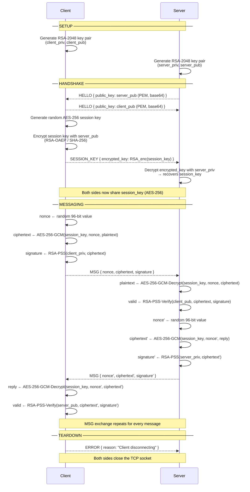

# Protocol Flow Diagram

## Full Session Sequence



---

## Wire Protocol Frame

Every message is a **length-prefixed JSON frame**:

```
┌─────────────────────────────────────────────────────────────┐
│  TCP Stream                                                  │
│                                                             │
│  ┌──────────────┬──────────────────────────────────────┐   │
│  │  4 bytes     │  N bytes                             │   │
│  │  (big-endian │  JSON payload                        │   │
│  │   uint32)    │                                      │   │
│  │    length N  │  { "type": "...", ... }               │   │
│  └──────────────┴──────────────────────────────────────┘   │
│                                                             │
│  Frames are sent back-to-back with no separator             │
└─────────────────────────────────────────────────────────────┘
```

---

## Message Payloads

### `HELLO`
```json
{
  "type": "HELLO",
  "public_key": "<base64-encoded PEM>"
}
```

### `SESSION_KEY`
```json
{
  "type": "SESSION_KEY",
  "encrypted_key": "<base64-encoded RSA-OAEP ciphertext>"
}
```

### `MSG`
```json
{
  "type": "MSG",
  "nonce":      "<base64  — 12 random bytes>",
  "ciphertext": "<base64  — AES-256-GCM encrypted payload + 16-byte auth tag>",
  "signature":  "<base64  — RSA-PSS signature over ciphertext bytes>"
}
```

### `ERROR`
```json
{
  "type": "ERROR",
  "reason": "<human-readable string>"
}
```

---

## Cryptographic Layers

```
┌─────────────────────────────────────────────────────────────┐
│  Application message  (plaintext string)                    │
├─────────────────────────────────────────────────────────────┤
│  AES-256-GCM encryption                                     │
│  key    = session_key  (32 bytes, exchanged at handshake)   │
│  nonce  = random 12-byte value (new for every message)      │
│  output = ciphertext ∥ 16-byte authentication tag           │
├─────────────────────────────────────────────────────────────┤
│  RSA-PSS digital signature                                  │
│  input  = ciphertext (not plaintext — sign after encrypt)   │
│  key    = sender's RSA-2048 private key                     │
│  hash   = SHA-256,  salt = maximum length                   │
├─────────────────────────────────────────────────────────────┤
│  JSON serialisation  (binary fields → base64 strings)       │
├─────────────────────────────────────────────────────────────┤
│  4-byte big-endian length prefix                            │
├─────────────────────────────────────────────────────────────┤
│  TCP socket                                                 │
└─────────────────────────────────────────────────────────────┘
```

---

## Key Exchange Detail

```
Client                                          Server
  │                                               │
  │  server_pub  ←────────────────────────────── │  (HELLO)
  │                                               │
  │ ──────────────────────────────→  client_pub  │  (HELLO)
  │                                               │
  │  session_key = random 32 bytes                │
  │  enc = RSA-OAEP(server_pub, session_key)      │
  │ ─────────────── enc ──────────────────────→  │  (SESSION_KEY)
  │                                               │
  │                     session_key = RSA-OAEP-  │
  │                     Decrypt(server_priv, enc) │
  │                                               │
  │    session_key  ══════════════  session_key   │
  │         (known only to client and server)     │
```
