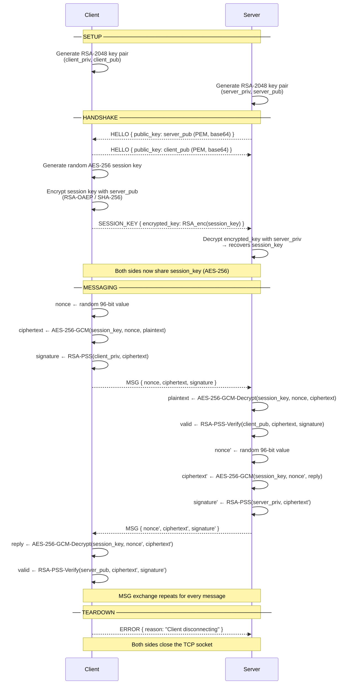

# CyberCrypto

CyberCrypto is a Python socket-based encrypted messaging demo. It runs a TCP server and one or more interactive clients, establishes a shared session key, encrypts messages with AES-256-GCM, and verifies sender identity and message integrity with RSA digital signatures and HMAC.

The project also includes predefined security test cases that demonstrate the difference between the full scheme and weaker configurations, including random-prime key exchange, HMAC tampering, digital-signature tampering, and a mode with no signature or HMAC.

## Dependencies

Required:

- Python 3.10 or newer
- `cryptography`
- `make` optional, only needed if you want to use the provided `Makefile` shortcuts

Install the Python dependency:

```bash
python3 -m pip install cryptography
```

## How To Run

Open two terminal windows in this folder.

Start the server:

```bash
python3 server.py
```

Or use the Makefile shortcut:

```bash
make server
```

Start the client in another terminal:

```bash
python3 client.py
```

Or use:

```bash
make client
```

By default, the server binds to `127.0.0.1:9000`, and the client connects to `127.0.0.1:9000`.

After connecting, type a message and press Enter to send it. Type `quit` to disconnect.

For multi-line messages:

```text
/multi
first line
second line
/send
```

## Command Options

### Server Options

```bash
python3 server.py --host 127.0.0.1 --port 9000 --test-case 0 --prime-bits 2048
```

- `--host`: Address the server binds to. Default is `127.0.0.1`.
- `--port`: TCP port the server listens on. Default is `9000`.
- `--test-case`: Selects a predefined security scenario. Valid values are `0`, `1`, `2`, `3`, and `4`. If omitted, the server displays an interactive menu.
- `--prime-bits`: Size of the random prime used in test case `1`. Default is `2048`. The value must be at least `256`.

### Client Options

```bash
python3 client.py --host 127.0.0.1 --port 9000
```

- `--host`: Server address to connect to. Default is `127.0.0.1`.
- `--port`: Server port to connect to. Default is `9000`.

The client receives the selected test case from the server, so the security mode is configured on the server side.

## Test Cases

| ID | Name | Key Exchange | Signature | HMAC | Purpose |
| --- | --- | --- | --- | --- | --- |
| `0` | CyberCrypto Scheme | Diffie-Hellman | Enabled | Enabled | Full secure configuration. |
| `1` | No Diffie-Hellman key exchange | Random prime | Enabled | Enabled | Demonstrates random-prime key exchange and runs a brute-force timing demo against a truncated key prefix. |
| `2` | HMAC Verification | Diffie-Hellman | Enabled | Enabled | Simulates message tampering by altering the HMAC before sending. |
| `3` | DS Verification | Diffie-Hellman | Enabled | Enabled | Simulates a man-in-the-middle or identity attack by altering the digital signature. |
| `4` | No DS and No HMAC | Diffie-Hellman | Disabled | Disabled | Sends encrypted messages without extra sender authentication or message-integrity checks. |

## Project Structure

```text
phase4/
├── client.py                  # Interactive encrypted messaging client
├── server.py                  # TCP server, test-case selector, and message verifier
├── crypto_utils.py            # Cryptographic helper functions
├── protocol.py                # JSON over TCP length-prefixed wire protocol
├── test.py                    # Small standalone HMAC experiment/demo
├── Makefile                   # Convenience commands for server/client
└── README.md                  # Project documentation
```

## How It Works

1. The server starts and selects a test case.
2. The client connects over TCP.
3. The server tells the client which key exchange method and test case are active.
4. The peers establish a shared AES-256 session key:
   - Test cases `0`, `2`, `3`, and `4` use Diffie-Hellman.
   - Test case `1` uses a server-generated random prime and derives a session key from it.
5. The client generates an RSA-2048 key pair and sends its public key to the server.
6. Each outgoing message is encrypted with AES-256-GCM.
7. Depending on the selected test case, the client also sends:
   - an RSA-PSS digital signature over the ciphertext
   - an HMAC-SHA256 value over the plaintext
8. The server verifies the configured protections before printing the decrypted message.

# Protocol Flow Diagram

## Full Session Sequence



---

## Wire Protocol Frame

Every message is a **length-prefixed JSON frame**:

```
┌─────────────────────────────────────────────────────────────┐
│  TCP Stream                                                  │
│                                                             │
│  ┌──────────────┬──────────────────────────────────────┐   │
│  │  4 bytes     │  N bytes                             │   │
│  │  (big-endian │  JSON payload                        │   │
│  │   uint32)    │                                      │   │
│  │    length N  │  { "type": "...", ... }               │   │
│  └──────────────┴──────────────────────────────────────┘   │
│                                                             │
│  Frames are sent back-to-back with no separator             │
└─────────────────────────────────────────────────────────────┘
```

---

## Message Payloads

### `HELLO`
```json
{
  "type": "HELLO",
  "public_key": "<base64-encoded PEM>"
}
```

### `SESSION_KEY`
```json
{
  "type": "SESSION_KEY",
  "encrypted_key": "<base64-encoded RSA-OAEP ciphertext>"
}
```

### `MSG`
```json
{
  "type": "MSG",
  "nonce":      "<base64  — 12 random bytes>",
  "ciphertext": "<base64  — AES-256-GCM encrypted payload + 16-byte auth tag>",
  "signature":  "<base64  — RSA-PSS signature over ciphertext bytes>"
}
```

### `ERROR`
```json
{
  "type": "ERROR",
  "reason": "<human-readable string>"
}
```

---

## Cryptographic Layers

```
┌─────────────────────────────────────────────────────────────┐
│  Application message  (plaintext string)                    │
├─────────────────────────────────────────────────────────────┤
│  AES-256-GCM encryption                                     │
│  key    = session_key  (32 bytes, exchanged at handshake)   │
│  nonce  = random 12-byte value (new for every message)      │
│  output = ciphertext ∥ 16-byte authentication tag           │
├─────────────────────────────────────────────────────────────┤
│  RSA-PSS digital signature                                  │
│  input  = ciphertext (not plaintext — sign after encrypt)   │
│  key    = sender's RSA-2048 private key                     │
│  hash   = SHA-256,  salt = maximum length                   │
├─────────────────────────────────────────────────────────────┤
│  JSON serialisation  (binary fields → base64 strings)       │
├─────────────────────────────────────────────────────────────┤
│  4-byte big-endian length prefix                            │
├─────────────────────────────────────────────────────────────┤
│  TCP socket                                                 │
└─────────────────────────────────────────────────────────────┘
```

---

## Key Exchange Detail

```
Client                                          Server
  │                                               │
  │  server_pub  ←────────────────────────────── │  (HELLO)
  │                                               │
  │ ──────────────────────────────→  client_pub  │  (HELLO)
  │                                               │
  │  session_key = random 32 bytes                │
  │  enc = RSA-OAEP(server_pub, session_key)      │
  │ ─────────────── enc ──────────────────────→  │  (SESSION_KEY)
  │                                               │
  │                     session_key = RSA-OAEP-  │
  │                     Decrypt(server_priv, enc) │
  │                                               │
  │    session_key  ══════════════  session_key   │
  │         (known only to client and server)     │
```


## Notes

- AES-GCM already provides authenticated encryption for the encrypted payload. The extra HMAC in this project is used as a separate educational integrity check.
- The brute-force demo in test case `1` does not brute-force the full 256-bit key. It only searches a small prefix and extrapolates timing.
- Run the server before starting the client.
